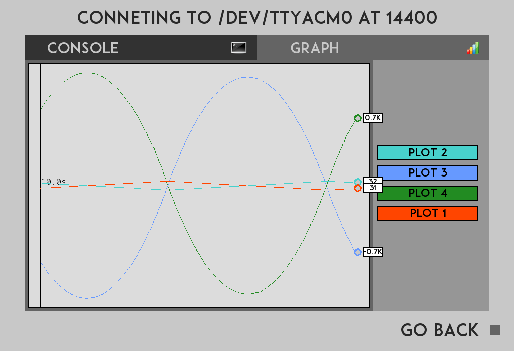
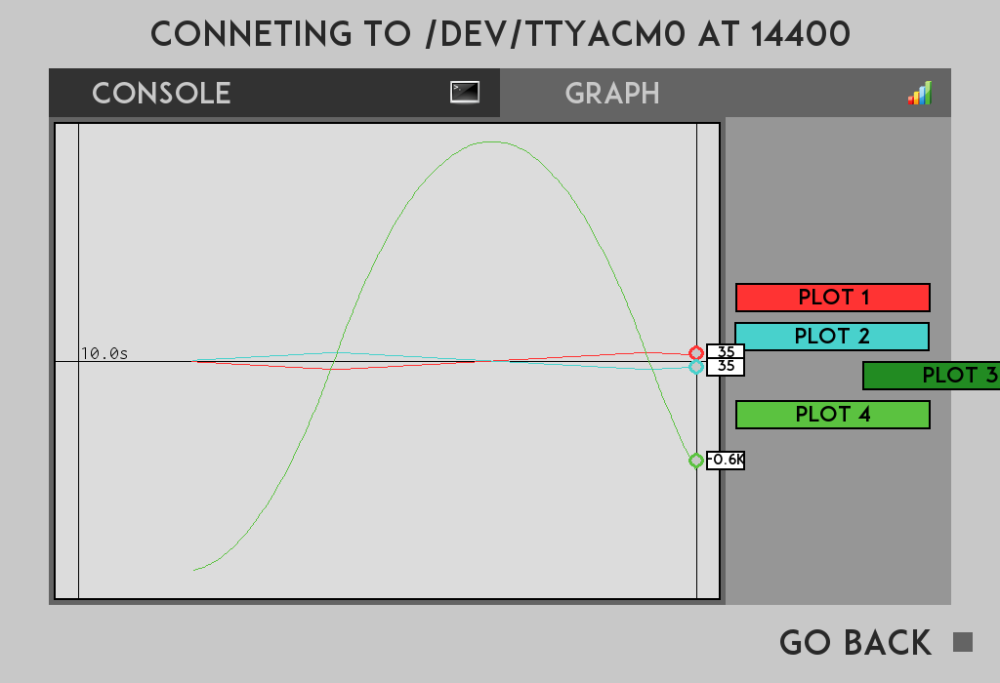
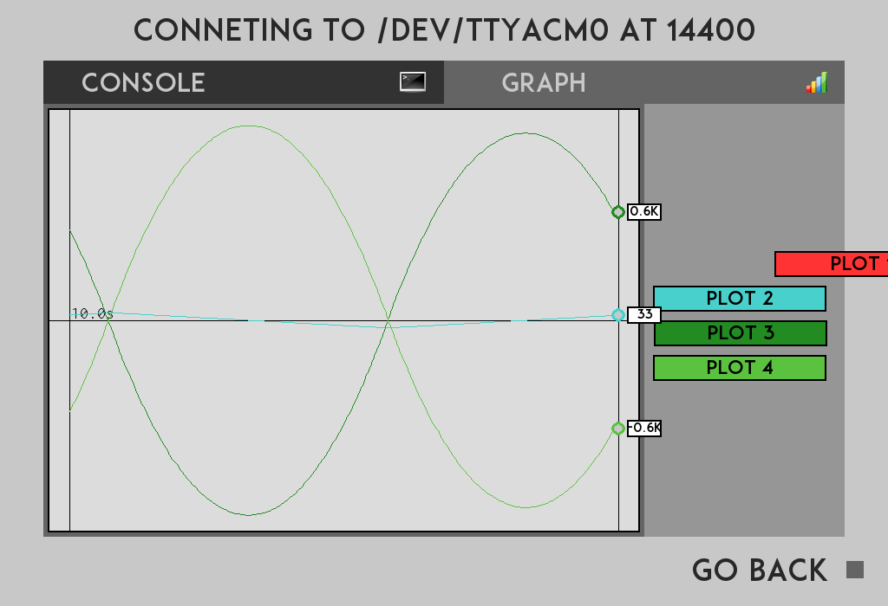
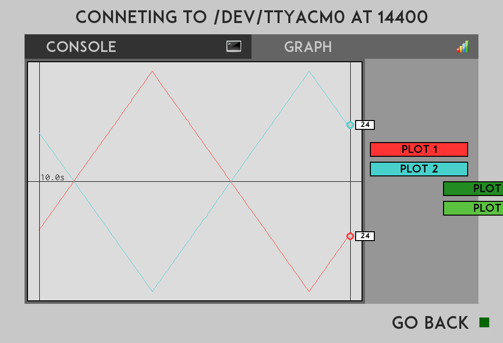

# SerialGraphicator
Open Source Free Serial Port Client capable of graph values that are received in **JSON format**
You can do projects with, for example, **arduino** or **microcontrollers** to transform data sent from them to computer into fancy **graphics**.



### Introduction ###

Hi. I'll explain how to use this simple but useful tool. First of all you need a **python** installation complemented with the **pygame** graphics library and the **pyserial** library. You'll find plenty of ways to install them on internet and usually you **won't have problems** when installing them. After that you only need to **execute** the final **graph.py** to make the program run. Here there are some links to make you learn how to install python, pygame and pyserial
[How to install python - How to install py-serial](https://learn.adafruit.com/arduino-lesson-17-email-sending-movement-detector/installing-python-and-pyserial)
[How to install pygame] (https://www.youtube.com/watch?v=0xgn-HKzZes) 

The program should **detect the ports autonomously** and will test to check data of all of them with this **baudrates**
+ 4800
+ 9600
+ 14400
+ 19200
+ 28800
+ 38400
+ 57600
+ 115200

. If something is recived in any port then the selector of that port will be highlighted. 

You can **change the baudrate** when you enter a port, you should only click on the **port title** in the upper part of the screen.


### Which format should you use to send information to the program? ###
You must use **json** format. This means the **two commands** you can use actually are
```
"{'COM':'plot', 'name':'Plot 1','value':4564564}\n"
```
to **plot** a point in the **graph**, where the 4564564 is the value to graph in that instant, and 'Plot 1' the name of the graph associated with it (the program autodetects when there is a new signal so no need of initial signal, just **update signals**). And remeber to set a '\n' (**end of line**) character after each signal sent because otherwise the program won't graph anything as it **will wait until the '\n' arrives** to divide the **signal**. If you want to **set the color** of the signal (rather than a random number) you can add a "color":(r,g,b) parameter altough I haven't tested yet it should work.

And the other **command** is 
```
"{'COM':'line','value':'This is a test of Serial Graphicator'}\n"
```
You should use this command to **send words** to be shown on the console of the program. Remember to use the **end of line** character also.


**Report any bug** to ariel.nowik@gmail.com. This program is **totally free** for all so feel free to use it, modify it or send feedback. Good Luck guys!


### Screenshots ###








